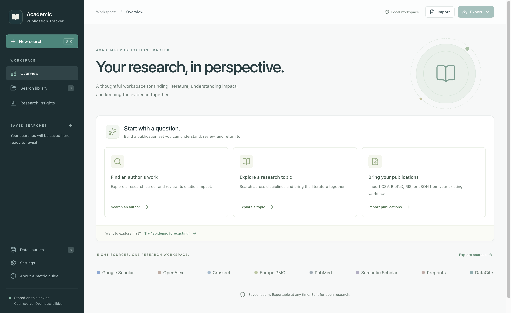
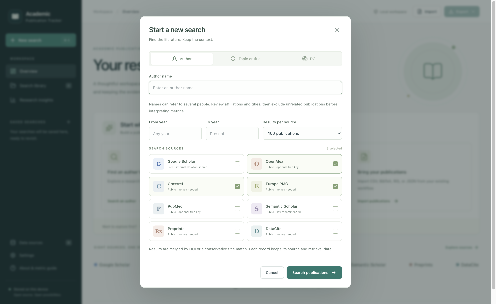

# Academic Publication Tracker

A modern, open-source desktop workspace for discovering scholarly publications, organizing searches, and understanding citation metrics. Built for macOS and Windows with one consistent interface.

Academic Publication Tracker is an independent project inspired by the academic workflow of Publish or Perish. Version 0.4 is an early release with its own interface and feature scope.



## What it does

- Search by topic, author name, or DOI with eight public and free-registration source choices.
- Search arXiv, bioRxiv, medRxiv, and other indexed preprint repositories together through Preprints.
- Discover datasets, software, and other DOI-identified research outputs through DataCite.
- Collect Google Scholar results internally, with automatic paging, progress, and stop controls.
- Keep named search snapshots with the original query, source provenance, and retrieval date. Right-click a saved search to open, rename, or delete it; deletion asks for confirmation.
- Merge duplicate records while retaining each source's reported citation count.
- Review publications with search, sorting, open-access filtering, inclusion/exclusion, notes, and tags.
- Explore citation metrics and publication-year charts, with explicit source and coverage limitations.
- Refresh into a new snapshot and compare summaries while retaining the previous search.
- Import and export CSV, BibTeX, RIS, and JSON, and back up or restore the full workspace.
- Work with saved results offline. Keep API keys encrypted with the operating system credential vault.

There is no subscription, project account, telemetry, hosted backend, or runtime LLM. Searches use provider data; parsing and citation calculations run with ordinary code. Public data-source policies and rate limits still apply.

## Install

Download the installer for your computer from the [Releases page](https://github.com/ausmeyer/academic_publication_tracker/releases):

| Platform                    | Package         | Installation                             |
| --------------------------- | --------------- | ---------------------------------------- |
| Mac with Apple Silicon      | `mac-arm64.dmg` | Open and drag the app to Applications    |
| Mac with an Intel processor | `mac-x64.dmg`   | Open and drag the app to Applications    |
| Windows x64                 | `win-x64.exe`   | Run the installer and follow the prompts |

Artifact filenames include the app name and version before the platform suffix. Mac packages require macOS 13 or later. Each installer contains the complete runtime. You do not need Node.js, Python, or a separate database. Internet access is needed for live searches; a source-specific API key is needed only where the source requires it.

Mac preview builds are not notarized by Apple. After trying to open a preview downloaded from this repository, macOS may offer **System Settings → Privacy & Security → Open Anyway**. This approves that app specifically. See [Apple’s instructions](https://support.apple.com/en-us/102445). Managed Macs may not allow an exception.

The v0.4.2 Mac installer has an invalid resource seal and can report that the app “is damaged.” Replace that app with a corrected build; do not treat this as an ordinary unidentified-developer warning. Replacing the app preserves saved searches in your user Library.

Windows preview builds are unsigned and may trigger SmartScreen. A package is only release-validated after installation and launch checks on its target platform.

## Data sources



| Source                                                                         | Use                                                                     | Access                                                       |
| ------------------------------------------------------------------------------ | ----------------------------------------------------------------------- | ------------------------------------------------------------ |
| [Google Scholar](https://scholar.google.com/intl/en/scholar/help.html)         | Search results with displayed citation counts                           | Free, internal collection in the desktop app                 |
| [OpenAlex](https://developers.openalex.org/)                                   | Broad scholarly metadata and citation counts                            | Public basic access; optional free API key for higher limits |
| [Crossref](https://www.crossref.org/documentation/retrieve-metadata/rest-api/) | DOI metadata and available cited-by counts                              | Public API; contact email recommended                        |
| [Europe PMC](https://europepmc.org/RestfulWebService)                          | Life sciences papers, preprints, open-access links, and citation counts | Public API                                                   |
| [PubMed](https://www.ncbi.nlm.nih.gov/books/NBK25501/)                         | Biomedical publication metadata                                         | Public API; optional NCBI key                                |
| [Semantic Scholar](https://www.semanticscholar.org/product/api)                | Scholarly metadata and citation counts                                  | Public access with strict limits; optional approved key      |
| Preprints                                                                      | Combined arXiv, Europe PMC preprints, and Crossref preprint records     | Public APIs; no key needed                                   |
| [DataCite](https://support.datacite.org/docs/api)                              | Datasets, software, preprints, and other research outputs               | Public API; no key needed                                    |

Google Scholar uses internal page collection, described below. Subscription-only Scopus and Web of Science interfaces are outside this release's scope. Author-name searches can include namesakes; inspect the records and exclude unrelated papers before interpreting metrics. Source coverage, metadata, key requirements, and service limits may change.

Citation counts belong to their source and retrieval time. Counts from different sources must not be added together. Missing citation data is not zero. Search results are capped per source and may be incomplete; metrics describe the included retrieved records, not a verified complete career. PubMed and arXiv do not supply citation counts through these adapters. Citation metrics should support expert judgment, not replace it.

## Combined preprint search

Choose **Preprints** in the search dialog to search arXiv alongside preprint records indexed by Europe PMC and Crossref. This brings bioRxiv and medRxiv together with additional indexed repositories such as Research Square and ChemRxiv. It replaces the arXiv-only source choice; existing arXiv snapshots remain readable and refreshable.

The collection alternates between providers, merges duplicates, and keeps at most your selected limit. Each record retains the index that supplied its metadata and citation count. Partial failures remain visible. Coverage depends on each index, so this is not an exhaustive search of every preprint server. Preprints and journal articles with different DOIs remain separate records. [Europe PMC preprint coverage](https://europepmc.org/help), [Crossref preprint metadata](https://www.crossref.org/documentation/schema-library/markup-guide-record-types/posted-content-includes-preprints/).

## Google Scholar

Choose **New search → Google Scholar**, enter a topic, author, or DOI, and click **Search publications**. The desktop app retrieves results internally and advances through available result pages, pausing between pages. Progress shows papers collected and pages read. **Stop and keep results** saves a partial collection; **Cancel search** discards the current search without changing saved searches.

If Google requires verification or sign-in, a dedicated window opens. Complete the requested step yourself and choose **Resume search**. The app does not solve or bypass challenges. Search limits, access restrictions, and changed page layouts can interrupt collection; any retrieved papers remain available with a notice. Scholar has no supported public bulk search API. See [Google Scholar search help](https://scholar.google.com/intl/en/scholar/help.html).

Citation counts, retrieval dates, and actual page addresses are retained; missing counts stay unknown. Search snippets are labeled as snippets. Collections describe the pages retrieved, not a verified complete bibliography. This workflow requires the desktop app. The browser development preview opens Scholar externally; exported bibliographic files can also be added through **Import**.

The collector waits for page contents and pagination links to settle. If a page keeps changing, it retains the collected records with an error. Scholar's displayed match count is treated as an estimate; a smaller retrieved collection receives an incomplete-results notice.

## Updating an earlier copy

Quit the running app before opening the new version. Opening another copy while the old one is running can bring the old process to the front. Use the new installer or app bundle, rather than an older mounted disk image. The app retains your existing local workspace. You can check the version in **About & metric guide**.

## Privacy and backups

The desktop app stores your workspace on your computer. API keys use operating system encryption and are never included in workspace exports. Email settings and publication notes are local plaintext. Providers receive the searches and credentials needed for their API. There is no automatic cloud synchronization.

Use workspace JSON backup before moving computers or making large changes. CSV, BibTeX, and RIS are useful for exchanging bibliographic records; full workspace JSON preserves search history and application-specific annotations. See [release and recovery notes](RELEASING.md) for file locations.

## Run from source

Install Node.js 24 LTS, then:

```sh
npm ci
npm run desktop
```

For browser UI development:

```sh
npm run dev
```

The browser preview uses local browser storage for workspaces and keeps settings in memory. Desktop mode provides the complete search and file workflow with secure credential persistence. To develop against a live renderer, run `npm run build`, start `npm run dev`, and launch Electron with `APT_RENDERER_URL=http://127.0.0.1:5173`. This override is disabled in packaged applications.

```sh
npm run typecheck
npm test
npx playwright install chromium
npm run test:e2e
npm run test:desktop
npm run test:scholar
npm run dist:mac  # build on macOS
npm run dist:win  # build on Windows
```

See the detailed [data-source guide](DATA_SOURCES.md) and [metric definitions](METRICS.md).

See the [verification record](VERIFICATION.md) for tested behavior and current release limits.

See [Contributing](../CONTRIBUTING.md), [Security](../SECURITY.md), and [Releasing](RELEASING.md). The desktop shell uses Electron; the interface uses React and TypeScript. The app has no runtime server dependency.

## License

[MIT](../LICENSE). Data remains subject to its providers' applicable terms and licenses.
